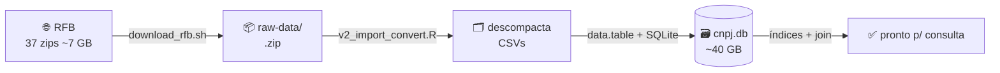
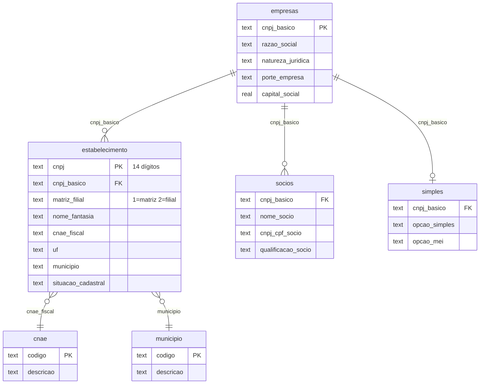

<div align="center">

# 🏢 BASE_CNPJ_RFB

### Base completa de CNPJs da Receita Federal em um único SQLite portátil

Baixa os [Dados Abertos de CNPJ da RFB](https://arquivos.receitafederal.gov.br/dados/cnpj/),
descompacta e monta **um único arquivo `.db`** — com índices prontos para consulta e
fácil de copiar para qualquer computador.


</div>

---

## 📊 A base em números

<div align="center">

| 🏭 Empresas (matrizes) | 🏬 Estabelecimentos | 🤝 Sócios | 🧾 Simples / MEI |
|:---:|:---:|:---:|:---:|
| **69.062.850** | **72.318.968** | **27.992.378** | **49.445.426** |

**Competência:** `2026-07` · **Extração RFB:** 11/07/2026 (`D60711`) · **Tamanho do `.db`:** ~40 GB · **Índices:** 20

</div>

---

## 📑 Sumário

- [Sobre](#-sobre)
- [Requisitos](#-requisitos)
- [Como atualizar a base](#-como-atualizar-a-base)
- [Esquema do banco](#-esquema-do-banco)
- [Exemplos de consulta](#-exemplos-de-consulta)
- [Estrutura do projeto](#-estrutura-do-projeto)
- [Notas técnicas (v1 → v2)](#-notas-técnicas-v1--v2)
- [Dados & licença](#-dados--licença)

---

## 💡 Sobre

A Receita Federal publica mensalmente **todo o cadastro de CNPJs** em ~37 arquivos `.zip`
(CSV `;`-separados, encoding Latin-1). Este projeto automatiza:



O resultado é **um único `data/cnpj.db`** — sem servidor, sem dependências em runtime.
Basta o arquivo e qualquer cliente SQLite.

---

## 🔧 Requisitos

Linux com **R 4.x** e alguns pacotes (binários via `apt`, **sem compilação**):

```bash
sudo apt-get install -y r-base-core \
  r-cran-data.table r-cran-rsqlite r-cran-dbi r-cran-glue r-cran-fs r-cran-stringi
```

Ferramentas de sistema: `curl`, `unzip`, `sqlite3`.

> 💡 `Rtools` é do Windows e **não** se aplica aqui.

---

## 🔄 Como atualizar a base

<table>
<tr><td><b>1️⃣ Competência</b></td><td>

No portal da RFB, a pasta atual fica em
`.../s/<TOKEN>?dir=/Dados/Cadastros/CNPJ/<AAAA-MM>`.
Anote o `<TOKEN>` da URL e o mês.

</td></tr>
<tr><td><b>2️⃣ Baixar</b></td><td>

Os **37 zips** (~7 GB) para `raw-data/`. Ajuste `TOKEN`/`REMOTE_DIR` no topo do script:

```bash
bash src/download_rfb.sh
```

Também dá para **baixar manualmente** pelo site (marcar a pasta inteira) — costuma ser
mais confiável, pois o servidor da RFB dá `HTTP 500` sob carga.
Arquivos: `Empresas0-9`, `Estabelecimentos0-9`, `Socios0-9`, `Simples`, `Cnaes`,
`Motivos`, `Municipios`, `Naturezas`, `Paises`, `Qualificacoes`.

</td></tr>
<tr><td><b>3️⃣ Construir</b></td><td>

Ajuste `dataReferencia` no topo do script para a competência baixada e rode:

```bash
Rscript src/v2_import_convert.R
```

⚠️ O script **aborta se `data/cnpj.db` já existir** — apague o antigo antes de recriar.

</td></tr>
<tr><td><b>4️⃣ Limpar</b><br/><i>(opcional)</i></td><td>

Após o build, os CSVs extraídos em `data/` (~27 GB) não são mais necessários:

```bash
find data/ -maxdepth 1 -type f ! -name 'cnpj.db' ! -name '*.log' -delete
```

</td></tr>
</table>

---

## 🗃️ Esquema do banco



**Tabelas grandes**

| Tabela | Descrição | Colunas-chave |
|---|---|---|
| `empresas` | Dados da matriz (razão social, natureza, porte, `capital_social` REAL) | `cnpj_basico` (8 díg.) |
| `estabelecimento` | Cada estabelecimento (matriz/filial): endereço, CNAE, situação | `cnpj_basico`, `cnpj` (14 díg.), `cnae_fiscal`, `uf`, `municipio` |
| `socios` | Sócios das **matrizes** (join onde `matriz_filial='1'`) | `cnpj`, `cnpj_basico`, `cnpj_cpf_socio`, `nome_socio` |
| `simples` | Opção pelo Simples Nacional / MEI | `cnpj_basico` |

**Tabelas de código** (`codigo`, `descricao`): `cnae` · `motivo` · `municipio` ·
`natureza_juridica` · `pais` · `qualificacao_socio`.

**Metadados:** `_referencia` → `CNPJ` (competência), `cnpj_qtde`, `gerado_em`.

<details>
<summary><b>📇 Os 20 índices criados</b></summary>

`empresas`: `cnpj_basico`, `razao_social` · `capital_social` (REAL, convertido de texto)
`estabelecimento`: `cnpj_basico`, `cnpj`, **`cnae_fiscal`**, `uf`, `municipio`, `nome_fantasia`
`socios`: `cnpj`, `cnpj_basico`, `cnpj_cpf_socio`, `nome_socio`, `representante_legal`, `nome_representante`
`simples`: `cnpj_basico` · tabelas de código: índice em `codigo`

</details>

---

## 🔎 Exemplos de consulta

```sql
-- Empresa completa por CNPJ (14 dígitos)
SELECT em.razao_social, es.nome_fantasia, es.uf, es.cnae_fiscal
FROM estabelecimento es
JOIN empresas em ON em.cnpj_basico = es.cnpj_basico
WHERE es.cnpj = '61686626000198';

-- Estabelecimentos por CNAE (usa idx_estabelecimento_cnae_fiscal — ~5 ms)
SELECT es.cnpj, es.nome_fantasia, es.uf, mu.descricao AS municipio
FROM estabelecimento es
LEFT JOIN municipio mu ON mu.codigo = es.municipio
WHERE es.cnae_fiscal = '6201501'      -- Desenvolvimento de software sob encomenda
  AND es.matriz_filial = '1';

-- Sócios de uma empresa
SELECT nome_socio, qualificacao_socio, data_entrada_sociedade
FROM socios WHERE cnpj_basico = '61686626';
```

Direto no terminal:

```bash
sqlite3 data/cnpj.db "SELECT descricao FROM cnae WHERE codigo='6201501';"
```

---

## 📁 Estrutura do projeto

```
src/
  download_rfb.sh        # baixa os zips da RFB (WebDAV público, resumível)
  v2_import_convert.R    # descompacta + monta o cnpj.db com índices  ← script atual
  V1_import_convert.R    # versão original (histórica; ver notas abaixo)
raw-data/                # zips baixados (~7 GB)   — NÃO versionado
data/cnpj.db             # banco final (~40 GB)    — NÃO versionado
README.md
```

> 🚫 **Os dados não vão para o Git.** `data/` (banco 40 GB) e `raw-data/` (zips 7 GB) estão
> no `.gitignore` — o GitHub rejeita arquivos >100 MB e a base é regenerável a qualquer
> momento pelos scripts. O repositório versiona **apenas código e documentação**.

---

## 🛠️ Notas técnicas (v1 → v2)

O `V1_import_convert.R` **não roda** como está. O `v2` corrige:

| # | Problema no v1 | Correção no v2 |
|---|---|---|
| 1 | Chave `}` órfã | Erro de sintaxe removido |
| 2 | `carregaTipo()` definida mas **nunca chamada** → tabelas grandes vazias | Chamadas adicionadas para `empresas`, `estabelecimento`, `socios`, `simples` |
| 3 | URL de download morta + `readline()` interativo | Download separado (`download_rfb.sh`), build não-interativo |
| 4 | Sem índice de CNAE | `idx_estabelecimento_cnae_fiscal` (+ `uf`, `municipio`) |

Extra: PRAGMAs de carga em massa (`journal_mode=OFF`, `synchronous=OFF`) e `ANALYZE` final.

---

## 📜 Dados & licença

Os dados são **públicos**, publicados pela Receita Federal do Brasil em
[Dados Abertos do CNPJ](https://dados.gov.br/dados/conjuntos-dados/cadastro-nacional-da-pessoa-juridica---cnpj).
Este repositório contém apenas o **código** de download/conversão e a documentação.
